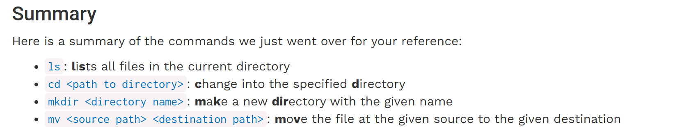

- [cs61a 2020 Fall (中文镜像网站)](https://chillyhigh.github.io/CS61A-CN/)
- [参考答案](https://github.com/FyisFe/UCB-CS61A-20Fall)
- [CS Plan上的介绍](https://cs-plan.com/CS%E5%9F%BA%E7%A1%80/%E8%AF%BE%E7%A8%8B%E6%8E%A8%E8%8D%90/%E7%BC%96%E7%A8%8B%E5%9F%BA%E7%A1%80/UCBCS61A/)
- [CS Wiki上的介绍](https://csdiy.wiki/%E7%BC%96%E7%A8%8B%E5%85%A5%E9%97%A8/Python/CS61A/)
  
---

#### 环境搭建
核心助手：任意一个AI，比如 Gemini；遇到任何问题，直接（截图）询问即可，大胆放心问，同时要注意要有自己的观察和思考。
1. 下载 git bash + vscode，在windows下操作。
2. git基础设置，包括用户名、邮箱；可以使用github，设置一下SSH认证。
   - 学习git日常使用流程：
  在项目根目录下，git init / git status / git add . / git commit -m "test" / git push；进阶技巧比如 .gitignore 的使用等等；
1. vscode终端可以设置为git bash。
   - **[Ctrl + `]**：打开终端
   - **[Ctrl + shift +`]**：打开新终端
   - pwd显示家目录；只要用vscode打开项目根目录，终端就会自动以项目根目录为当前目录。

---

#### 终端 基本操作：

此外也可以参照 [UNIX tutorial](https://chillyhigh.github.io/CS61A-CN/articles/unix.html)。

---

#### vscode 基本操作
1. 标签页与文件切换
    **[ Ctrl + Tab ]**：切换最近使用的标签页
    **[ Ctrl + P ]**：打开文件
    **[ Ctrl + W ]**：关闭当前标签页
&nbsp;
2. 编辑操作
    **[ Ctrl + / ]**：注释
    **[ Alt + Up/Down ]**：整行移动（Ctrl + L 选中当前行）
    **[ Ctrl + D ]**：多光标选择
    **[ Shift + Alt + F ]**：格式化代码
    **[ Alt + Left ]**：跳转到前一位置
&nbsp;

3. 界面操作
    **[ Ctrl + B ]**：隐藏左边栏（注意markdown文件中不可用）
    **[ Ctrl + \ ]**：窗口一分为二
    **[ Ctrl + 1/2]**：来回切换
&nbsp;
4. 终极命令：**Ctrl + Shift + P**

---

