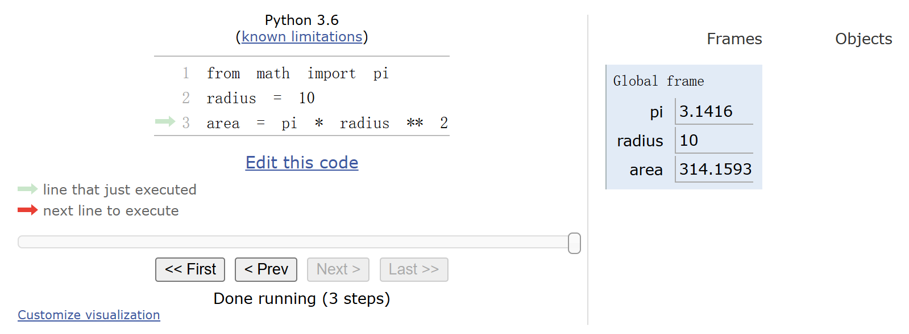

#### Problem
Q: 什么是 environment？ 包含定义、变量名以及 bindings?

Q: execution 和 evaluation 的区别是什么？
- 执行：没有产生某个值，而是产生了某种作用；比如执行一个赋值语句（bind），执行一个函数定义语句（def）
- 求值：所有表达式都可以求值

#### Chapter 1.1 Getting Started
- 从REPL（read-eval-print-loop）开始，体验最基础的交互过程；（ai推荐安装 IPython）

- Python编程里5个重要的概念：
  - Statements & Expressions
  - Functions
  - Objects
  - Interpreter（区别于编译器Compiler）
  - 核心在于 data & logic

- Error的处理：
  - 计算机既powerful又stupid，机器没有程序员那样的real insights；
  - debugging的技巧如下：
    - 渐进测试，不要等到代码写完再测试，每写好一个模块，就可以测试一下；
    - 隔离错误，从而方便追溯到发生错误的那一小部分；
    - 检验假设，代码实现基于的是程序员自己的假设前提，回过头检验假设的正确性；
    - 寻求帮助，不论是问其他人还是浏览博客论坛，学会团队协作解决问题；

#### Chapter 1.2 Elements of Programming
任何一种强大的语言都具备三种机制：
- 基本的表达式和语句
- 组合方法
- 抽象方法

- expressions: 任何表达式都可以被evaluate（求值）
  - operator 
  - operand
  - **nested：recursive，运用“树”来理解嵌套结构**
  - 每一类表达式都有特殊的 evaluation procedure

- assignment statement: **binds** a name with a value;
  - 优先 evaluate 右边的表达式
  - 函数名也可以被 rebind
  - 变量名也可以 bind 到函数名

- names and the environment：
> The possibility of binding names to values and later retrieving those values by name means that the interpreter must maintain some sort of memory that keeps track of the names, values, and bindings. **This memory is called an *environment*.**

- pure function 和 non-pure function：
  - 纯函数只返回值；非纯函数不仅可以返回值，也有副作用，可以改变环境。

---

#### Lecture 2
- 所有的表达式都可以用 函数调用表达式 来等效代替。

表达式的类型：
- primitive expression: operator、numeral、name
- call expression：function call

**environment diagrams:**

- an environment is a sequence of frames.
  
- 抽象方法：
  - 赋值语句
  - 函数定义

- a function signature 用于构建 local frame（区别于 global frame）
  

#### Homework 01
largest_factor(n):
- factor是成对的且都小于 n/2
- n % factor = 0

hailstone:
- 冰雹猜想，正整数n开始，偶数则除以2，奇数则乘以3再加1，直到1。

#### Q & A
Q: frame 在定义函数的时候创建还是在调用函数的时候创建
  